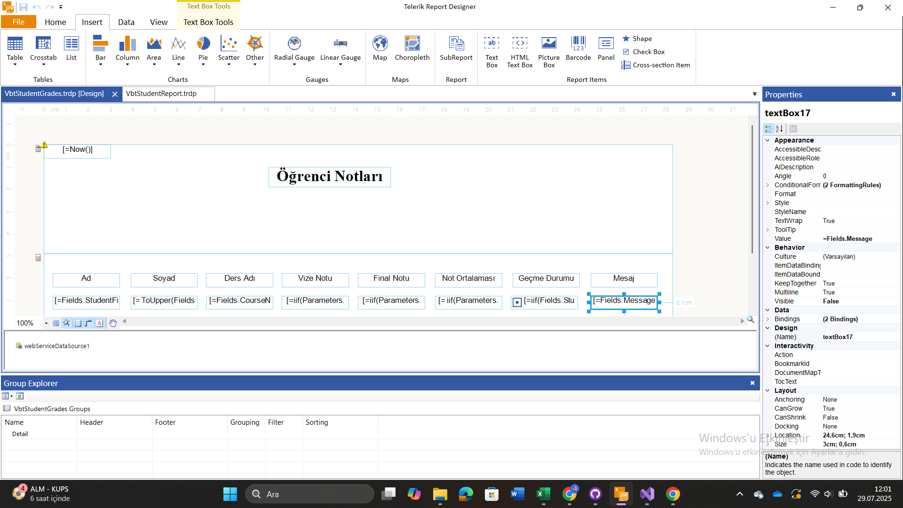
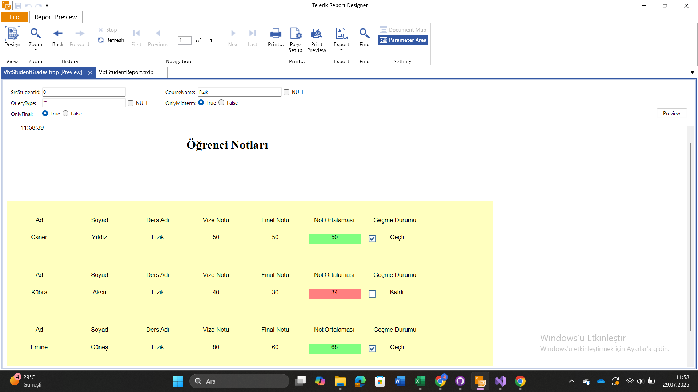
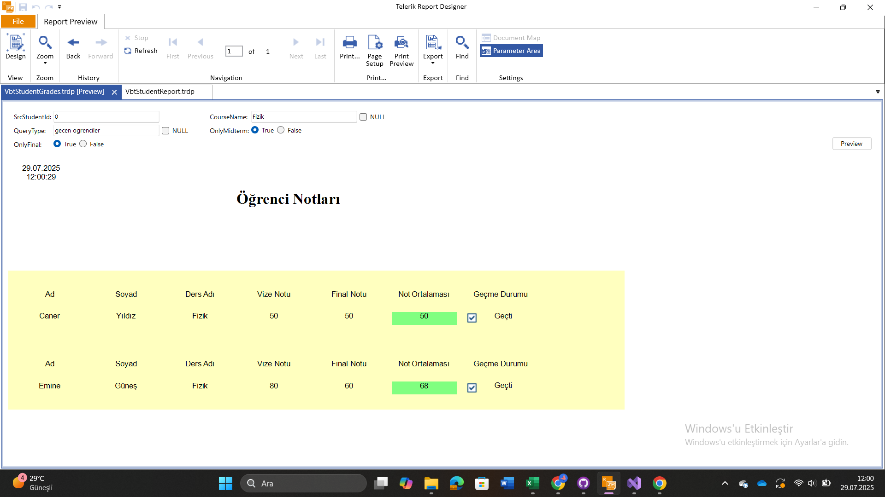
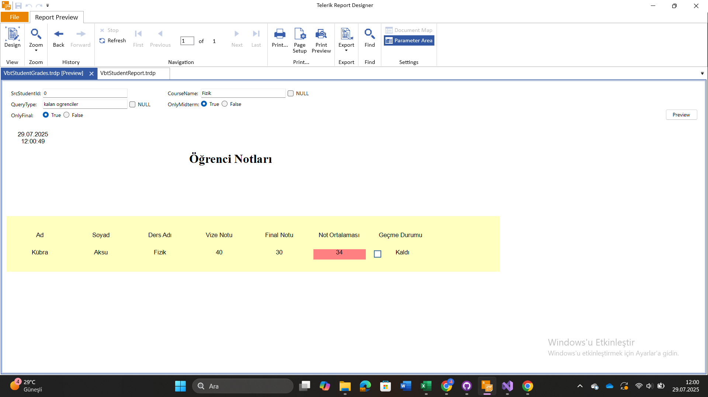
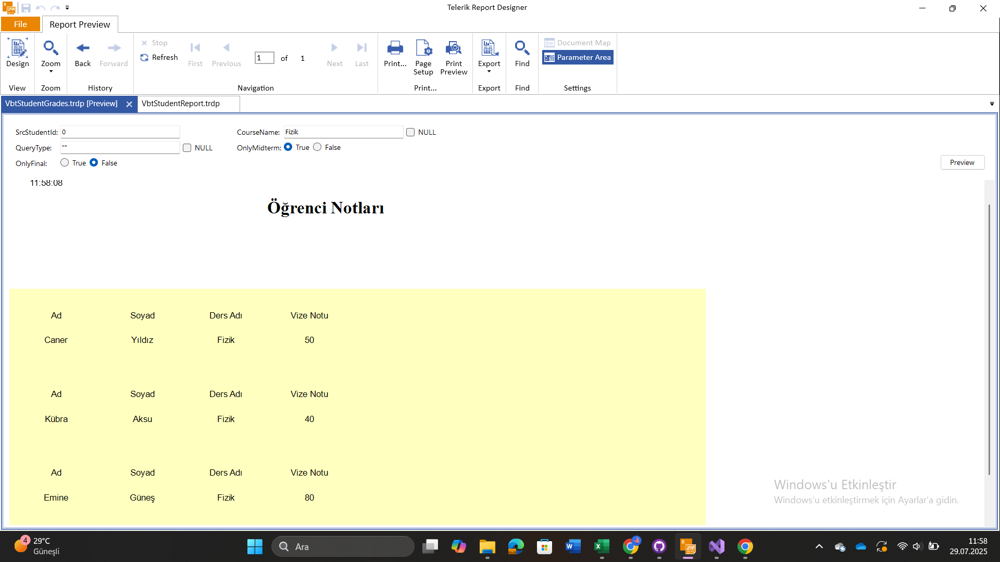
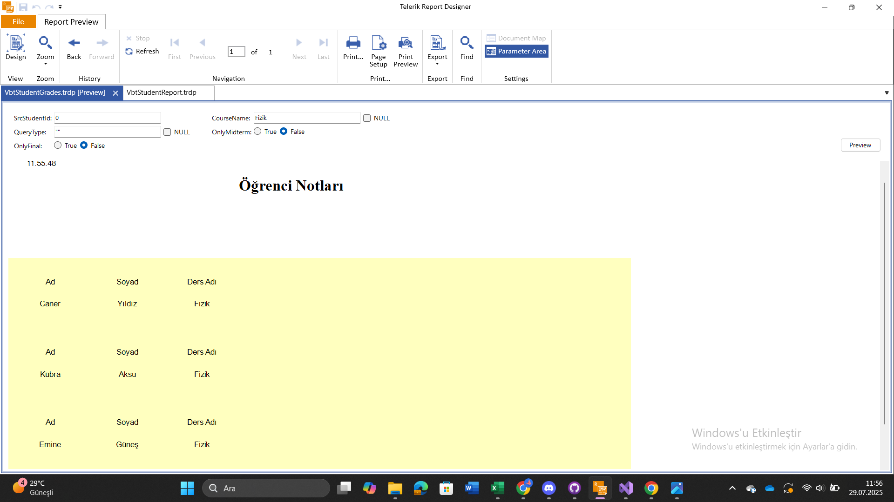
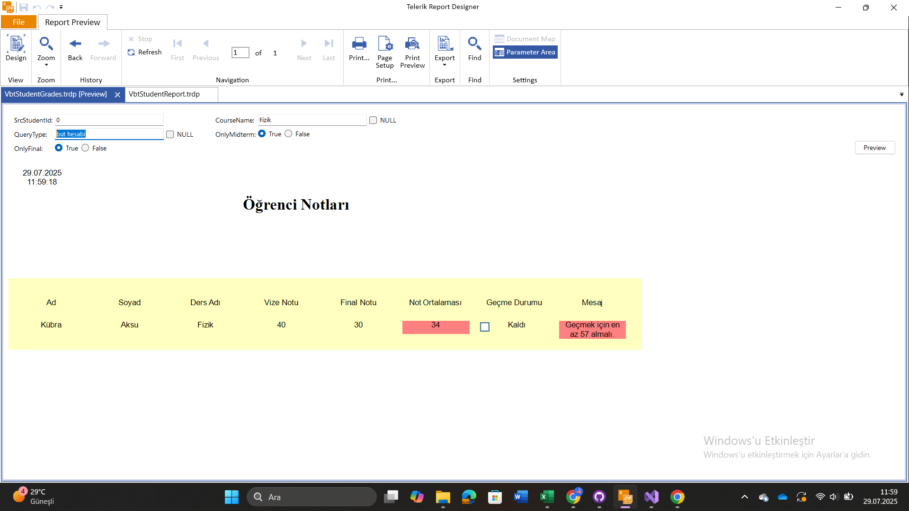
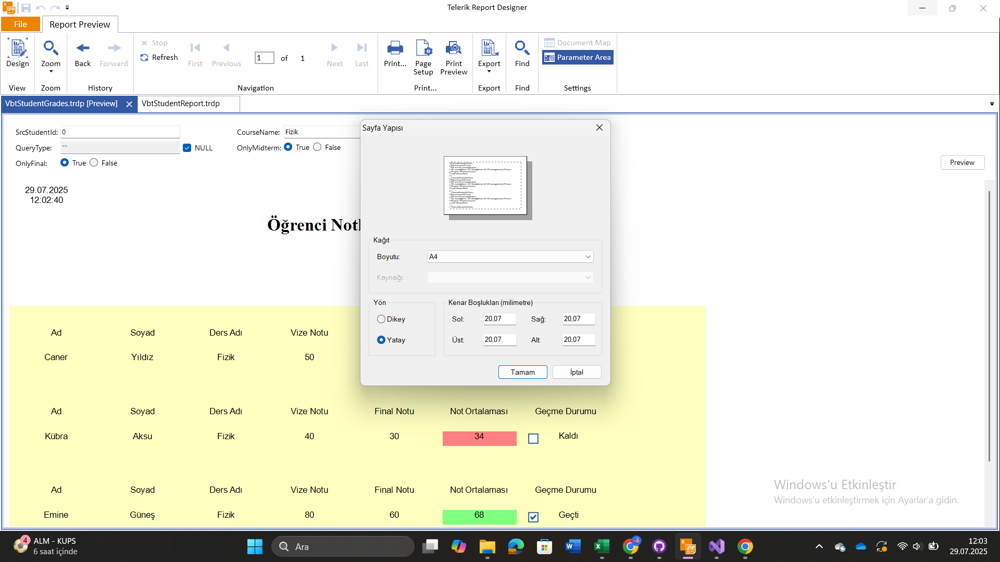
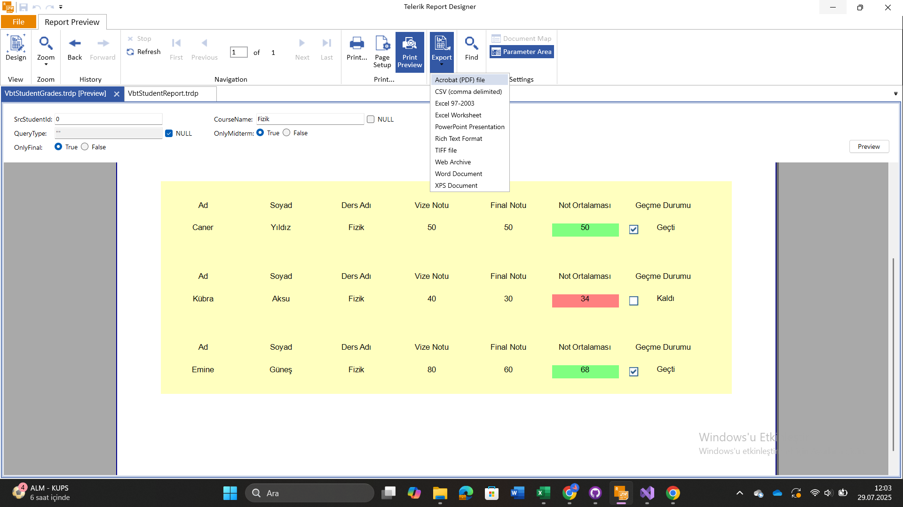
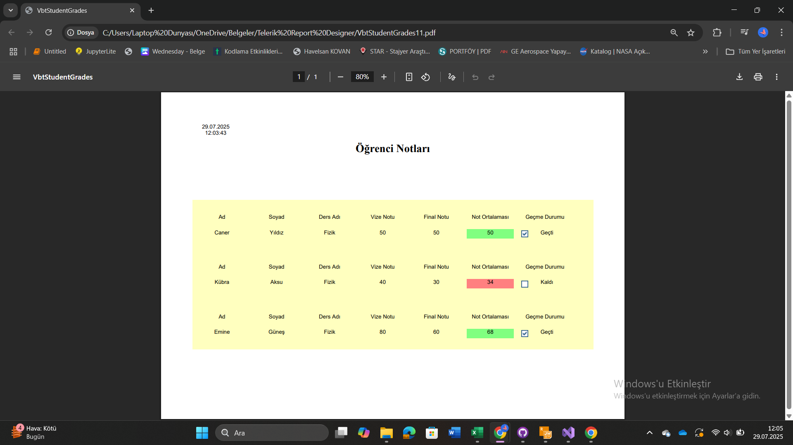

# StajVBTRaport

Telerik Reporting platformu kullanılarak geliştirilen bu .NET Core projesi, öğrencilerin ders notlarını, ortalamalarını, geçme/kalma durumlarını ve detaylı başarı analizlerini dinamik olarak görüntüleyip raporlamaya olanak tanır.

## 🚀 Proje Özellikleri

- Öğrenci, ders ve not verilerinin yönetimi
- LINQ ile güçlü veri analizleri:
  - Ders bazlı ortalama
  - Genel başarı ortalaması
  - Geçme/kalma durumu
  - Bütünleme durumu
- Kullanıcı seçimlerine göre özelleştirilebilir sorgular
- Telerik Reporting ile gelişmiş görsel rapor tasarımı
- Koşullu biçimlendirme (conditional formatting) ile notlara göre renklendirme
- Rapor filtreleme ve görünürlük kontrolleri (örn: sadece vize, sadece final)
- Checkbox ve parametrelerle dinamik içerik yönetimi

## 🧰 Kullanılan Teknolojiler

- .NET Core 6
- Telerik Reporting
- LINQ
- Entity Framework Core
- C#

---

## 🖼️ Ekran Görüntüleri

### 📄 Tüm Sorgular ve Rapor Türleri

### 📚 Sadece Fizik Notlarını Gösteren Sorgu

### ✅ Fizikte Geçen Öğrenciler

### ❌ Fizikte Kalan Öğrenciler

### 🧪 Sadece Vize (Midterm) Notları

### 📄Vize ve Final Notları Olmadığında : Ortalama ve geçme kalma durumlaarı gösterilmez. 

### 🔁 Bütünleme Durumu Hesaplama: Mesaj sadece büt hesabında görünür.

### ⚙️ Veri Kaynağı ve Ayar Ekranı

Page Setup ile pdf çıktısının ayarı yapılır.

### 🖨️ PDF Oluşturma ve Çıktı Önizlemesi
Export yazan kısımdan pdf çıktısı ya da başka bir formatta rapor alınır.

---

